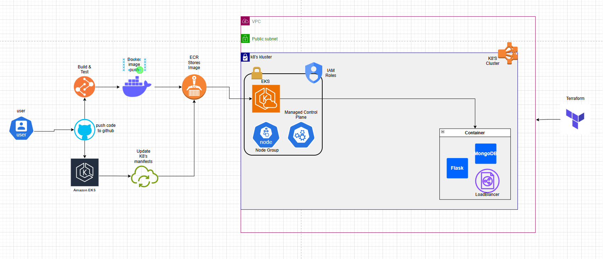

# [PROJECT_NAME]

> [SHORT_PROJECT_DESCRIPTION] - One or two sentences explaining what this project demonstrates.

## Table of Contents

- [Overview](#overview)
- [Architecture](#architecture)
- [Technology Stack](#technology-stack)
- [Repository Structure](#repository-structure)
- [Prerequisites](#prerequisites)
- [Getting Started](#getting-started)
- [CI/CD Pipeline](#cicd-pipeline)
- [Contributing](#contributing)
- [Release History](#release-history)
- [Contact](#contact)
- [Acknowledgments](#acknowledgments)

## Overview

Brief description of the project, its purpose, and what DevOps practices it demonstrates.

Key features:

- [FEATURE_1]
- [FEATURE_2]
- [FEATURE_3]

## Architecture

[ARCHITECTURE_DESCRIPTION]



## Technology Stack

| Category             | Technologies   |
| -------------------- | -------------- |
| **Infrastructure**   | [TECHNOLOGIES] |
| **Containerization** | [TECHNOLOGIES] |
| **CI/CD**            | [TECHNOLOGIES] |
| **Version Control**  | [TECHNOLOGIES] |
| **Security**         | [TECHNOLOGIES] |
| **Application**      | [TECHNOLOGIES] |
| **Database**         | [TECHNOLOGIES] |

## Repository Structure

```
project-root/
├── [DIRECTORY_1]/       # [DESCRIPTION]
│   ├── [FILE_1]         # [DESCRIPTION]
│   └── [FILE_2]         # [DESCRIPTION]
├── [DIRECTORY_2]/       # [DESCRIPTION]
│   ├── [SUBDIRECTORY_1]/# [DESCRIPTION]
│   └── [SUBDIRECTORY_2]/# [DESCRIPTION]
└── [FILE_3]             # [DESCRIPTION]
```

## Prerequisites

Requirements for building and running the project:

- [PREREQUISITE_1]
- [PREREQUISITE_2]
- [PREREQUISITE_3]

## Getting Started

Follow these instructions to set up the project locally and deploy it to your cloud environment.

### Infrastructure Setup

1. **[STEP_1_TITLE]**

```bash
# [STEP_1_COMMAND_EXAMPLE]
cd [DIRECTORY]
[COMMAND_1]
```

2. **[STEP_2_TITLE]**

```bash
# [STEP_2_COMMAND_EXAMPLE]
[COMMAND_2]
```

Expected output:

```
[EXPECTED_OUTPUT_EXAMPLE]
```

3. **[STEP_3_TITLE]**

```bash
[COMMAND_3]
```

### Application Deployment

1. **[STEP_1_TITLE]**

```bash
[COMMAND_1]
```

2. **[STEP_2_TITLE]**

```bash
[COMMAND_2]
```

3. **[STEP_3_TITLE]**

```bash
[COMMAND_3]
```

Expected result: [EXPECTED_RESULT_DESCRIPTION]

## CI/CD Pipeline

[PIPELINE_DESCRIPTION]


## Contributing

(For open source projects)

[CONTRIBUTION_GUIDELINES]

1. Fork the repository
2. Create your feature branch (`git checkout -b feature/[FEATURE_NAME]`)
3. Commit your changes (`git commit -m '[DESCRIPTIVE_MESSAGE]'`)
4. Push to the branch (`git push origin feature/[FEATURE_NAME]`)
5. Open a Pull Request

Please read [CONTRIBUTING.md](CONTRIBUTING.md) for detailed guidelines.

## Release History

- 0.2.1
  - CHANGE:
- 0.2.0
  - CHANGE:
  - ADD:
- 0.1.1
  - FIX:
- 0.1.0
  - First real release
  - CHANGE:
- 0.0.1
  - Initial Version

## Contact

[YOUR_NAME] - LinkedIn - [EMAIL]

Project Link: [https://github.com/[USERNAME]/[REPOSITORY]](https://github.com/[USERNAME]/[REPOSITORY])

## Acknowledgments

- [ACKNOWLEDGMENT_1]
- [ACKNOWLEDGMENT_2]
- [ACKNOWLEDGMENT_3]
